# AnonyHire

AI-Driven Privacy & Equity Shield for Recruitment

本專案是一套基於 Claude Code 的企業級招募監管工具，旨在解決 AI 招募中的**法規合規**與**演算法偏見**挑戰。透過 **物理脫敏** 與 **多層級倫理稽核**，確保 AI 在篩選履歷時完全符合隱私保護與公平競爭原則。

> [!NOTE]
> **為什麼這很重要？**
> 隨著全球 AI 法規（如 EU AI Act）將招募列為「高風險應用」，企業必須證明其 AI 決策路徑中已排除受保護特徵（如年齡、性別、族群），以降低法律曝險並落實 ESG 社會責任。

> [!TIP]
> **English Version**: For international users, please see [README_EN.md](README_EN.md) for documentation in English.

## 運作流程

```mermaid
flowchart TD
    INPUT[原始履歷 PDF]

    INPUT --> MASK

    subgraph STEP1["① 物理脫敏  pii_mask.py"]
        MASK[PDF 提取<br/>PyMuPDF → pdfminer 備援]
        MASK --> TOK[PII Token 化<br/>姓名 / Email / 電話]
        TOK --> HARD[硬編碼遮蔽<br/>年齡 / 年份 / 性別 / 年次]
        HARD --> BL[遮蔽清單<br/>中英雙語規則檔]
    end

    BL --> PDF_OUT[audit_ready.pdf<br/>物理黑條 PDF]
    BL --> VAULT[vault_id.json<br/>Token 對照表 &#40;本機限定&#41;]

    PDF_OUT -->|"⚠ 必須開新對話"| ANALYSIS

    subgraph STEP2["② AI 分析  隔離對話"]
        ANALYSIS[傳入脫敏 PDF<br/>使用企業授權之招募工具]
        ANALYSIS --> REPORT[analysis_output.txt<br/>AI 分析報告]
    end

    REPORT --> AUDIT

    subgraph STEP3["③ 雙重稽核  pii_audit.py"]
        AUDIT[pii_audit.py]
        AUDIT --> PRIV[privacy_audit.py<br/>vault 比對 · 偵測洩漏]
        AUDIT --> FAIR[fairness_audit.py<br/>FAIL / WARN 兩層偏見偵測]
        PRIV --> LOG[violations_log.json]
        FAIR --> LOG
    end

    LOG --> IMPROVE

    subgraph STEP4["④ 自我優化  self_improve.py"]
        IMPROVE[self_improve.py]
        IMPROVE --> BL_UPDATE[漏洞詞補入遮蔽清單<br/>PII + Fairness FAIL 雙路]
        IMPROVE --> SUMMARY[summary_YYYY-MM-DD.md<br/>人工審查清單]
        IMPROVE --> FEEDBACK[feedback_for_ai.md<br/>下次分析補強指令]
    end

    BL_UPDATE -.->|自動學習回饋| BL

    classDef step fill:#f0f7ff,stroke:#2563eb,color:#1e3a5f
    classDef node fill:#ffffff,stroke:#93c5fd,color:#1e40af
    classDef output fill:#f0fdf4,stroke:#16a34a,color:#14532d
    classDef warn fill:#fff7ed,stroke:#ea580c,color:#7c2d12
    class STEP1,STEP2,STEP3,STEP4 step
    class MASK,TOK,HARD,BL,AUDIT,PRIV,FAIR,IMPROVE,BL_UPDATE node
    class PDF_OUT,VAULT,REPORT,LOG,SUMMARY,FEEDBACK output
    class ANALYSIS warn
```



---

## 合規與倫理基礎 (Compliance & Ethical Foundation)

AnonyHire 的設計核心參照了國內外多項招募與 AI 監管標準：

### 🇹🇼 台灣法規對接
- **《個人資料保護法》**：確保原始個資（姓名、聯絡方式）在進入 AI 系統前已完成物理脫敏。
- **《就業服務法》第 5 條**：嚴格稽核 AI 報告是否涉及種族、階級、宗教、性別、性傾向、年齡等 18 項就業歧視項目。
- **《性別工作平等法》**：自動遮蔽育嬰假、產假等可能導致差別待遇的代理指標。

### 🌐 國際標準規範
- **EU AI Act (歐盟人工智慧法案)**：針對招募等「高風險系統」，落實透明度與去偏見稽核要求。
- **EEOC (美國均等就業機會委員會)**：防範演算法對受保護群體產生「實質上的不利影響 (Adverse Impact)」。
- **NYC Local Law 144 (紐約市第 144 號地方法)**：落實「自動就業決策工具 (AEDT)」的年度偏見審核精神。

---

## 主要特性

### 1. 多層備援 PDF 提取
- **PyMuPDF** 優先提取；偵測到 CID 字型亂碼時自動切換 **pdfminer.six**。
- 適用於各式 CID 字型 PDF（含求職平台匯出格式）。

### 2. 硬編碼人口統計遮蔽
不依賴規則檔解析，直接在程式碼層保證以下項目必定遮蔽：
- 年齡（`50歲` → `[AGE_REDACTED]`）
- 性別（緊接年齡後的男/女 → `[GENDER_REDACTED]`）
- 民國年次（`75年次` → `[BIRTHYEAR_REDACTED]`）
- 出生日期（`[BIRTHDATE_REDACTED]`）

### 3. 全年份封印
所有西元 1900–2099 四位數年份強制替換為 `[YEAR_REDACTED]`，防止年資/年齡推算。

### 4. 物理 PDF 黑條
使用 `fitz.add_redact_annot` 對姓名、電話、地址、Email、年齡、年份畫上黑條，無法透過選取文字或 OCR 還原。

### 5. 中文姓名自動偵測
- `--cname` 可明確指定額外中文名稱
- `detect_chinese_name.py` 在未指定時自動從 PDF 文字偵測中文姓名

### 6. 雙重稽核 Agent
- **Privacy Audit**：比對 vault 原始值，偵測個資洩漏
- **Fairness Audit**：偵測 AI 報告中是否含性別/年齡/族群等偏見關鍵字

### 7. 彙整報告 + 人工審查判斷
每次批次執行後產出單一 `reports/summary_YYYY-MM-DD.md`，清楚列出：
- 需人工審查（隱私洩漏 / 公平性疑慮 / 稽核錯誤）
- 全部通過

---

## 安裝與設定 (Installation)

### 1. 安裝為 Claude Code Skill
將本專案連結至您的 Claude Code 環境，即可在對話中直接啟動隱私閘門：

```bash
# 1. 複製本專案
git clone https://github.com/chengwesley/AnonyHire.git
cd AnonyHire

### 2. 安裝 Python 依賴
本專案依賴 `PyMuPDF` (及備援 `pdfminer.six`) 進行 PDF 文字提取與物理遮蔽。請在您的 Python 環境中執行：

```bash
pip install -r requirements.txt
```

### 3. 註冊 Skill (在 Claude Code 中執行)
請確保您位於專案根目錄，然後執行：

```bash
claude skill add .
```

---

## 快速上手 (Quick Start)

### 批次處理 (Batch Mode)
如果您有大量的 PDF 履歷需要同時處理，可以使用 `--batch` 參數：

```bash
python scripts/pii_mask.py --batch real/
```

### 單份 PDF 履歷（標準流程）

**Step 1：物理脫敏**
```bash
python scripts/pii_mask.py --pdf real/<file>.pdf --name <主要姓名> [--ename <英文名>] [--cname <額外中文名>]
```
產出：
- `masked/audit_ready_<file>.pdf` — 物理黑條 PDF
- `masked/vault_<stem>.json` — Token 對照表（嚴禁外傳）

**Step 2：外部 AI 分析（必須開新對話）**

使用 Step 1 產出的 `masked/audit_ready_<file>.pdf` 進行分析，確保使用經企業授權之招募工具。

**Step 3：稽核**
```bash
python scripts/pii_audit.py <candidate_id> <analysis_output.txt> --tool "<招募工具名稱>"
```
產出：
- `reports/violations_log.json` — 累積稽核結果
- `reports/projects/<PID>/<CID>/CERTIFICATE.md` — 每位候選人的**倫理審核證書**（含隱私與公平性雙重稽核結果）
- `reports/projects/<PID>/<CID>/analysis_original.txt` — 原始 AI 報告存檔

**Step 4：彙整報告 + 治理優化**
```bash
python scripts/self_improve.py
```
產出：
- `reports/summary_YYYY-MM-DD.md` — 當日所有候選人的治理彙整報告

---

## 遮蔽規格

| 類型 | 範例 | Token |
|------|------|-------|
| 姓名 | 王小明 | `[CANDIDATE_001]` |
| Email | abc@gmail.com | `[EMAIL_002]` |
| 電話 | 0912-345-678 | `[PII_003]` |
| 年份 | 2019, 1995 | `[YEAR_REDACTED]` |
| 年齡 | 36歲 | `[AGE_REDACTED]` |
| 性別 | 男 / 女 | `[GENDER_REDACTED]` |
| 民國年次 | 75年次 | `[BIRTHYEAR_REDACTED]` |
| 出生日期 | 1990/01/01 | `[BIRTHDATE_REDACTED]` |
| 敏感關鍵字 | 育嬰假, ADHD | `[SENSITIVE_XXX]` |

---

## 檔案結構

```
scripts/
  pii_mask.py             # 遮蔽核心（PDF提取 + Token化 + 物理黑條）
  pii_audit.py            # 稽核協調器（串接 Privacy + Fairness Agent）
  self_improve.py         # 治理優化 + 彙整報告產出
  privacy_audit.py        # 隱私稽核 Agent（vault 比對）
  fairness_audit.py       # 公平性稽核 Agent（偏見關鍵字偵測）
  detect_chinese_name.py  # 中文姓名自動偵測
rules/
  masking_rules.md        # 雙語遮蔽規則（Regex + 遮蔽清單 + Auto-Learned）
  fairness_principles.md  # 公平性稽核原則（含國際法規參考）
masked/                   # 物理遮蔽 PDF + vault JSON（僅本機保存）
reports/
  violations_log.json          # 所有稽核結果（累積式）
  summary_YYYY-MM-DD.md        # 當日彙整報告
  feedback_for_ai.md           # 給下次 AI 分析的補強指令
  projects/
    <PID>/
      <CID>/
        CERTIFICATE.md         # 倫理審核證書（隱私 + 公平性雙重稽核）
        analysis_original.txt  # 原始 AI 報告存檔
real/                     # 原始履歷 PDF 輸入
```

---

## 包容性設計 (Inclusive Design)

AnonyHire 的核心理念是**「最小化無關偏好，最大化專業價值」**。

我們對性別（包含多元性別）、身分（包含原住民、新住民等）與特殊生理狀況進行遮蔽，並非認為這些身分需被「隱藏」，而是為了在招募的第一階段消除潛意識偏見，確保每一位候選人的專業技能都能在平等的起跑線上被看見。

本工具致力於符合 **DEI (Diversity, Equity, and Inclusion)** 原則，並在開發過程中持續進行「自我倫理稽核」，以確保技術邏輯本身不帶有排他性。

---

## 注意事項與 AI 限制 (Disclaimer & Limitations)

> [!CAUTION]
> **AI 運作限制說明**
> 1. **非 100% 準確度**：本系統核心採用 AI 模型（LLM）進行語意分析，受限於模型能力，可能存在**誤判 (False Positive)** 或 **漏判 (False Negative)** 的風險。
> 2. **Human-in-the-Loop (人工覆核)**：本工具定位為「輔助監管」，最終招募決策與稽核結論應由專業 HR 或合規人員進行最後確認（參考 `reports/summary.md` 中的「需人工審查」清單）。
> 3. **規則更新**：偏見詞彙與法律標準會隨時代演進，建議定期維護 `rules/` 資料夾中的規則檔。

---

---

## 授權協議 (License)

本專案採用 **MIT License** 授權。您可以自由使用、修改與散佈本程式碼，但請保留原作者之署名與授權聲明。詳見 [LICENSE](LICENSE) 檔案。
