# AnonyHire

AI-Driven Privacy & Equity Shield for Recruitment

AnonyHire is an enterprise-grade recruitment governance tool built for Claude Code. It addresses the challenges of **Regulatory Compliance** and **Algorithmic Bias** in AI-assisted hiring. By leveraging **Physical Redaction** and **Multi-Layer Ethical Auditing**, AnonyHire ensures that AI resume screening remains 100% compliant with privacy and fairness standards.

> [!NOTE]
> **Why it matters?**
> With global AI regulations (like the EU AI Act) categorizing recruitment as a "High-Risk Application," enterprises must demonstrate that their AI decision paths exclude protected characteristics (age, gender, ethnicity) to mitigate legal risks and fulfill ESG responsibilities.

## Workflow

```mermaid
flowchart TD
    INPUT[Original Resume PDF]

    INPUT --> MASK

    subgraph STEP1["① Physical Redaction  pii_mask.py"]
        MASK[PDF Extraction<br/>PyMuPDF → pdfminer fallback]
        MASK --> TOK[PII Tokenization<br/>Name / Email / Phone]
        TOK --> HARD[Hardcoded Masking<br/>Age / Year / Gender / Birth Year]
        HARD --> BL[Masking List<br/>Bilingual Rules]
    end

    BL --> PDF_OUT[audit_ready.pdf<br/>Physical Redacted PDF]
    BL --> VAULT[vault_id.json<br/>Token Vault &#40;Local only&#41;]

    PDF_OUT -->|"⚠ Must start a new chat"| ANALYSIS

    subgraph STEP2["② AI Analysis  Isolated Session"]
        ANALYSIS[Input Redacted PDF<br/>Using Authorized Tools]
        ANALYSIS --> REPORT[analysis_output.txt<br/>AI Analysis Report]
    end

    REPORT --> AUDIT

    subgraph STEP3["③ Dual Auditing  pii_audit.py"]
        AUDIT[pii_audit.py]
        AUDIT --> PRIV[privacy_audit.py<br/>Vault Check · Leak Detection]
        AUDIT --> FAIR[fairness_audit.py<br/>Bias Detection]
        PRIV --> LOG[violations_log.json]
        FAIR --> LOG
    end

    LOG --> IMPROVE

    subgraph STEP4["④ Governance Improvement  self_improve.py"]
        IMPROVE[self_improve.py]
        IMPROVE --> BL_UPDATE[Add Leaks to Masking List<br/>PII + Fairness FAIL paths]
        IMPROVE --> SUMMARY[summary_YYYY-MM-DD.md<br/>Manual Review List]
        IMPROVE --> FEEDBACK[feedback_for_ai.md<br/>AI Feedback Instruction]
    end

    BL_UPDATE -.->|Auto-Learned Feedback| BL

    classDef step fill:#f0f7ff,stroke:#2563eb,color:#1e3a5f
    classDef node fill:#ffffff,stroke:#93c5fd,color:#1e40af
    classDef output fill:#f0fdf4,stroke:#16a34a,color:#14532d
    classDef warn fill:#fff7ed,stroke:#ea580c,color:#7c2d12
    class STEP1,STEP2,STEP3,STEP4 step
    class MASK,TOK,HARD,BL,AUDIT,PRIV,FAIR,IMPROVE,BL_UPDATE node
    class PDF_OUT,VAULT,REPORT,LOG,SUMMARY,FEEDBACK output
    class ANALYSIS warn
```



---

## Compliance & Ethical Foundation

AnonyHire is designed with reference to major global and local standards:

### 🌐 International Standards
- **EU AI Act**: Transparency and bias-auditing requirements for High-Risk AI systems.
- **EEOC (US)**: Prevention of "Adverse Impact" on protected groups (e.g., the 4/5ths rule).
- **NYC Local Law 144**: Audit requirements for Automated Employment Decision Tools (AEDT).

### 🇹🇼 Taiwan Compliance
- **Personal Data Protection Act**: Ensures physical redaction before AI processing.
- **Employment Service Act (Article 5)**: Audits against 18 types of employment discrimination.
- **Gender Equality in Employment Act**: Redacts indicators for maternity leave or gender-based identifiers.

---

## Features

### 1. Multi-Layer Fallback PDF Extraction
- Supports **PyMuPDF** for speed and **pdfminer.six** for complex CID fonts.
- Built-in **Chinese Name Detection** for automated anonymization.

### 2. Physical PDF Redaction
- Uses `fitz.add_redact_annot` to apply unremovable black bars to PII.
- Unlike metadata-only redaction, the text is physically removed and cannot be recovered via OCR or text selection.

### 3. Automated Governance Loop
- **Privacy Agent**: Compares AI reports against the local vault to detect PII leakage.
- **Fairness Agent**: Scans for 18+ categories of protected identity markers.
- **Audit Certificates**: Generates a professional **Ethical Screening Certificate** for every candidate.

---

## Installation

### 1. Clone the Project
```bash
git clone https://github.com/chengwesley/AnonyHire.git
cd AnonyHire
```

### 2. Install Dependencies
```bash
pip install -r requirements.txt
```

### 3. Add as Claude Code Skill
```bash
claude skill add .
```

---

## Quick Start (Batch Processing)
```bash
python scripts/pii_mask.py --batch real/
```

## Quick Start (Individual File)

**Step 1: Physical Redaction**
```bash
python scripts/pii_mask.py --pdf real/resume.pdf --name "John Doe" --ename "John"
```
**Output:**
- `masked/audit_ready_resume.pdf` — Black-bar redacted PDF.
- `masked/vault_resume.json` — Token mapping (Keep locally, do NOT share).

**Step 2: External AI Analysis (Start a NEW chat Session)**

Provide the `audit_ready_resume.pdf` to your authorized AI analysis tool.

**Step 3: Ethics Audit**
```bash
python scripts/pii_audit.py <candidate_id> <analysis_report.txt> --tool "Workday AI"
```
**Output:**
- Centralized audit log: `reports/violations_log.json`.
- Candidate certificate: `reports/projects/<PID>/<CID>/CERTIFICATE.md`.
- Governance Summary: `python scripts/self_improve.py`.

---

## Redaction Specifications

| Category | Example | Token |
|----------|---------|-------|
| Name | John Doe | `[CANDIDATE_001]` |
| Email | abc@gmail.com | `[EMAIL_002]` |
| Phone | 0912-345-678 | `[PII_003]` |
| Year | 2019, 1995 | `[YEAR_REDACTED]` |
| Age | 36 years old | `[AGE_REDACTED]` |
| Gender | Male / Female | `[GENDER_REDACTED]` |
| Birth Year | 1980 | `[BIRTHYEAR_REDACTED]` |
| Date of Birth | 1990/01/01 | `[BIRTHDATE_REDACTED]` |
| Sensitive Keywords| LGBTQ+, ADHD | `[SENSITIVE_XXX]` |

---

## Directory Structure

```
scripts/
  pii_mask.py             # Redaction Engine (PDF Extractor + Tokenizer)
  pii_audit.py            # Audit Coordinator (Privacy + Fairness)
  self_improve.py         # Governance Improvement + Summary Generator
  privacy_audit.py        # Privacy Agent (Vault comparison)
  fairness_audit.py       # Fairness Agent (Bias detection)
  detect_chinese_name.py  # Chinese Name Auto-Detector
rules/
  masking_rules.md        # Redaction Rules (Regex + Masking List)
  fairness_principles.md  # Ethical Principles & Compliance Standards
masked/                   # Redacted PDFs + Vault JSON (Local only)
reports/
  violations_log.json          # Cumulative audit results
  summary_YYYY-MM-DD.md        # Daily Governance Summary
  feedback_for_ai.md           # Instructions for the next AI analysis
  projects/
    <PID>/
      <CID>/
        CERTIFICATE.md         # Ethical Screening Certificate
        analysis_original.txt  # Snapshot of original AI report
real/                     # Input folder for original resumes
```

---

## Inclusive Design

AnonyHire's core philosophy is **"Minimize Irrelevance, Maximize Professional Value."**

We redact gender (including non-binary identities), ethnicity, and specific physiological conditions not to "hide" them, but to eliminate subconscious bias during the first stage of recruitment, ensuring every candidate's skills are seen on an equal playing field.

---

## License

This project is licensed under the **MIT License**.
